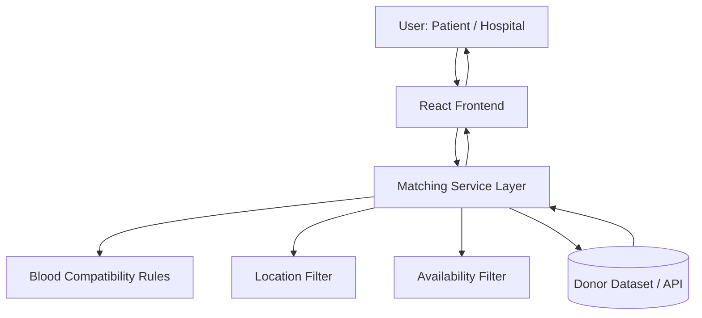
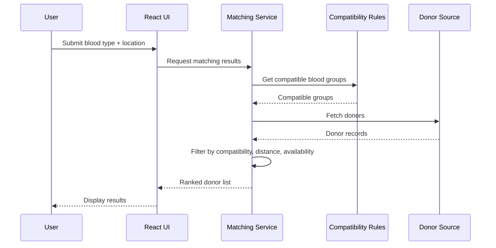

# LifeLine.ai

A production-minded blood donor matching platform that connects patients and hospitals with compatible donors based on blood type, location proximity, and availability.

## Overview

### Problem Statement
Finding blood donors during urgent situations is often slow, fragmented, and dependent on informal networks. Existing workflows can introduce delays in identifying eligible donors nearby.

### Motivation
LifeLine.ai was built to treat donor discovery as an engineering problem: model eligibility, reduce search time, and improve matching reliability through a clear and maintainable system design.

### Objectives
- Build a reliable donor–recipient matching workflow.
- Prioritize compatible, nearby, and currently available donors.
- Keep architecture modular and maintainable for future scaling.
- Provide a clean foundation for observability, security, and contributor onboarding.

---

## Key Features

### Core Functionality
- **Blood type compatibility matching** based on transfusion rules.
- **Location-aware donor discovery** to reduce time-to-contact.
- **Availability filtering** to prioritize active donors.
- **Structured donor profile model** to support consistent matching and search behavior.

### Technical Highlights
- Deterministic matching logic separated from UI concerns.
- Frontend architecture organized by feature boundaries.
- API-ready service layer to support migration from mock/static data to backend integration.
- Maintainable codebase with linting and consistent project conventions.

---

## Architecture

### High-Level Architecture
LifeLine.ai currently follows a client-centric architecture with clear service boundaries, designed to evolve into a full client-server deployment.



### Component Responsibilities
- **UI Layer (React):** handles user interaction, form state, and result rendering.
- **Matching Service:** orchestrates compatibility, distance, and availability checks.
- **Rule Engine:** encapsulates blood-group compatibility logic.
- **Data Access Layer:** abstracts donor data source (local JSON today, API/database later).

### Data Flow
1. User submits blood group and location inputs.
2. Matching service validates and normalizes input.
3. Compatibility rules filter eligible donor types.
4. Location + availability filters rank and narrow results.
5. UI renders prioritized donor list for contact action.

---

## Tech Stack

| Category | Technologies |
|----------|--------------|
| Frontend | React, JavaScript (ES6+) |
| Build Tooling | Vite |
| Styling | CSS |
| Linting / Quality | ESLint |
| Package Management | npm |
| Version Control | Git + GitHub |
| Diagramming / Docs | Mermaid, Markdown |

### Why These Technologies
- **React:** component model supports modular UI development and long-term maintainability.
- **Vite:** fast local development and lightweight production builds.
- **ESLint:** enforces code consistency and helps prevent common defects.
- **Mermaid + Markdown:** documentation-as-code approach makes architecture explainable and versioned alongside implementation.

---

## System Design

### Design Principles
- **Separation of concerns:** matching logic, UI rendering, and data access are isolated.
- **Single responsibility:** each module owns one behavior (rules, filtering, presentation).
- **Extensibility:** architecture supports adding authentication, notifications, and analytics without major rewrites.

### Scalability Considerations
- Current design supports migration from local data to remote APIs.
- Matching pipeline can be moved server-side for centralized rule management.
- Data model can be indexed for geospatial and blood-type queries as dataset grows.

### Reliability Mechanisms
- Deterministic filtering flow with predictable outputs.
- Input validation and defensive checks for incomplete records.
- Lint-driven quality gates to reduce regressions.

### Security Measures
- Input sanitization at form boundaries.
- Principle of least privilege for future API integrations.
- No sensitive donor metadata exposed beyond operational need.
- Planned support for auth + role-based access control in multi-actor workflows.

### Performance Optimizations
- Fast dev/build cycle using Vite.
- Client-side filtering for low-latency response on moderate datasets.
- Clear path to server-side pagination/caching for larger traffic volumes.

### Engineering Trade-offs
- **Current:** simpler client-first implementation accelerates iteration.
- **Trade-off:** limited control for large-scale concurrent usage.
- **Planned evolution:** transition matching and ranking to backend services for stronger scalability, security, and auditability.

---

## Project Structure

```text
LifeLine.ai/
├── public/                 # Static assets
├── src/
│   ├── components/         # Reusable UI components
│   ├── pages/              # Route-level pages/views
│   ├── services/           # Matching and filtering logic
│   ├── data/               # Local/mock donor data (replaceable by API)
│   ├── utils/              # Helpers, validators, shared utilities
│   ├── App.jsx             # Root app composition
│   └── main.jsx            # Entry point
├── .eslintrc.*             # Linting configuration
├── package.json
└── README.md
```

---

## Matching Workflow (Sequence Diagram)



---

## Getting Started

### Prerequisites
- Node.js 18+
- npm 9+

### Installation
```bash
git clone https://github.com/ShaikYasir/LifeLine.ai.git
cd LifeLine.ai
npm install
```

### Run Locally
```bash
npm run dev
```

### Production Build
```bash
npm run build
npm run preview
```

---

## Roadmap

- [ ] Move matching engine to backend service (Node.js/Express or equivalent).
- [ ] Add donor verification and secure authentication flow.
- [ ] Introduce geospatial indexing for faster proximity search.
- [ ] Add observability (request metrics, error tracking, audit logging).
- [ ] Add automated tests (unit/integration/e2e) and CI pipeline.

---

## Contribution Guidelines

Contributions are welcome.  
Please open an issue first for major changes and include:
- problem description,
- proposed approach,
- expected impact on architecture.

For code contributions:
1. Fork the repo
2. Create a feature branch
3. Add/update tests where applicable
4. Submit a pull request with clear implementation notes
